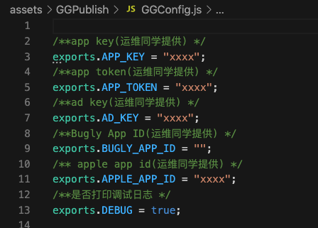
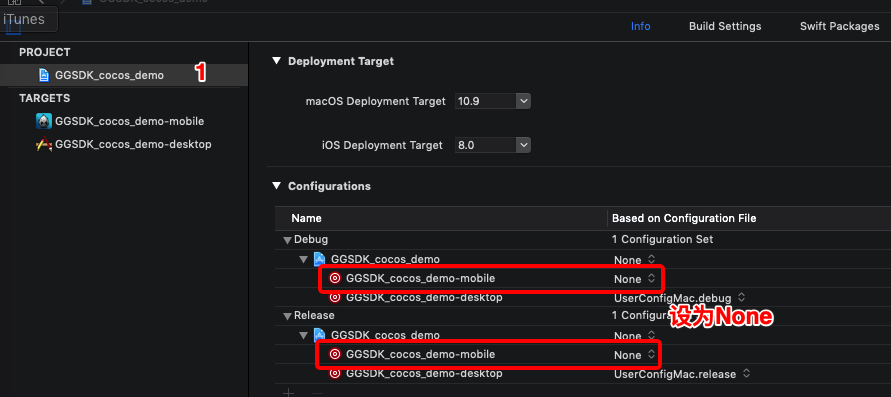
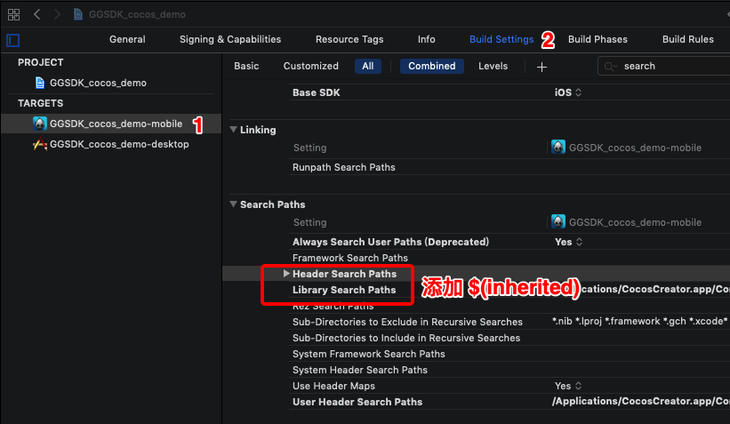
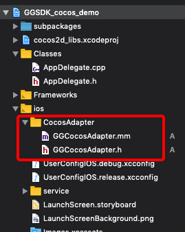

# GameGoing Publish SDK Integrated


方便开发者快速集成发行能力。

支持：

- iOS
- Cocos

## Cocos Creator 接入

### Cocos Creator 指引

#### 集成

将 GGPublish-JS 文件夹下文件导入cocos 工程；

####配置

在GGConfig.js 文件中完成配置，具体信息由运营同学提供；



####接口使用

##### 初始化

```
GGSDK.init();
```

##### 展示激励视频广告

```js
GGSDK.showRewardedVideo("rewardDouble_video",()=>{
            //激励展示
            console.log("ggcocos激励广告展示");
        },(errMsg)=>{
            //激励展示失败
            console.log("ggcocos激励广告失败："+errMsg);
        },()=>{
            //奖励用户
            console.log("ggcocos给用户发放奖励");
        },()=>{
            //奖励用户    
            console.log("ggcocos激励广告关闭");     
        });
```

##### 是否有激励视频缓存

```js
GGSDK.hasRewardedVideo();
```

##### 展示插屏广告

```js
GGSDK.showInterstitial("gameOver_ins",()=>{
            
            console.log("ggcocos插屏广告展示");
        },(errMsg)=>{
           
            console.log("ggcocos插屏广告失败："+errMsg);
        },()=>{
               
            console.log("ggcocos插屏广告关闭");     
        });
```

##### 事件打点

```js
GGSDK.track("eventName");

//或者

let info = {
            key_1: "value_1",
            key_2: "value_2",
        }
GGSDK.track("eventName",info);
```

### iOS指引

**通过cocoapods集成：**

1. 先安装[Cocoapods](https://guides.cocoapods.org/using/getting-started.html)；
2. 通过 `pod repo update` 更新仓库；
3. cocos creator构建工程完成后，在  `项目根目录/build/jsb-link/frameworks/runtime-src/proj.ios_mac`创建podfile文件，并添加:

```objective-c
target 'xxxxxxx-mobile' do
platform :ios, '9.0'

pod 'GGPublish'
 
end
```

4. 点击 XXXXX.xcodeproj 文件打开工程



在对应位置添加 **$(inherited)**



5. 新建位于当前目录下的终端窗口，执行：

1. ```
   pod install
   ```

6. 将 `CocosAdapter`文件夹下的文件导入Xcode工程：



至此完成iOS端的接入。

#### 增加广告源

在podfile 中添加对应adapter后，执行pod install 即可。

```
pod 'IronSourceAdColonyAdapter'
pod 'IronSourceAdMobAdapter'
pod 'IronSourceAmazonAdapter'
pod 'IronSourceAppLovinAdapter'
pod 'IronSourceChartboostAdapter'
pod 'IronSourceFacebookAdapter'
pod 'IronSourceFyberAdapter'
pod 'IronSourceHyprMXAdapter'
pod 'IronSourceInMobiAdapter'
pod 'IronSourceMaioAdapter'
pod 'IronSourceMintegralAdapter'
pod 'IronSourcePangleAdapter'
pod 'IronSourceTapjoyAdapter'
pod 'IronSourceUnityAdsAdapter'
pod 'IronSourceVungleAdapter'
```

